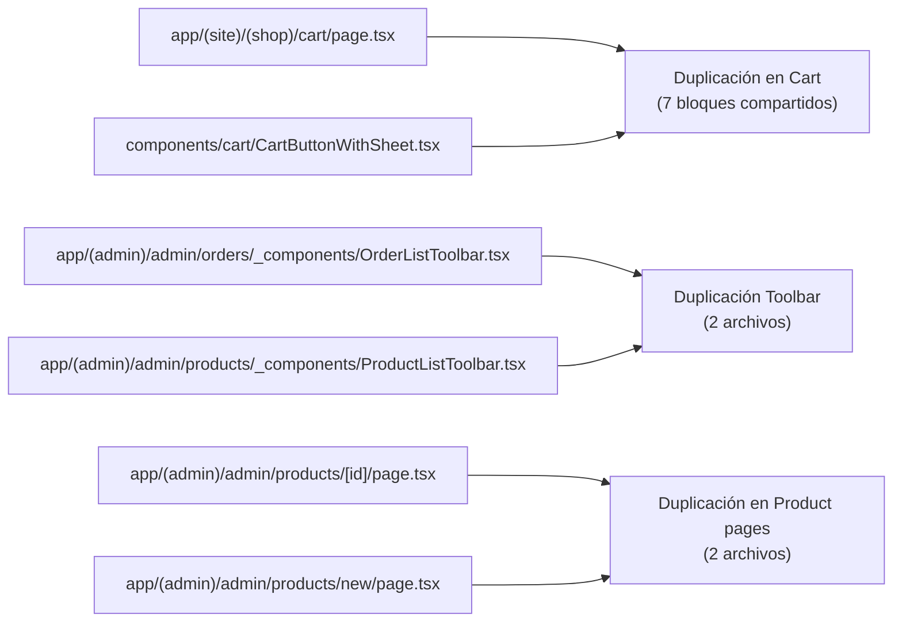

```mermaid
flowchart LR

  %% Archivos
  CartPage["app/(site)/(shop)/cart/page.tsx"]
  CartSheet["components/cart/CartButtonWithSheet.tsx"]

  OrdersToolbar["app/(admin)/admin/orders/_components/OrderListToolbar.tsx"]
  ProductsToolbar["app/(admin)/admin/products/_components/ProductListToolbar.tsx"]

  ProductEdit["app/(admin)/admin/products/[id]/page.tsx"]
  ProductNew["app/(admin)/admin/products/new/page.tsx"]

  %% Duplicados (agrupados para legibilidad)
  DupCart["Duplicación en Cart\n(7 bloques compartidos)"]
  DupToolbar["Duplicación Toolbar\n(2 archivos)"]
  DupProductPages["Duplicación en Product pages\n(2 archivos)"]

  %% Relaciones
  CartPage --> DupCart
  CartSheet --> DupCart

  OrdersToolbar --> DupToolbar
  ProductsToolbar --> DupToolbar

  ProductEdit --> DupProductPages
  ProductNew --> DupProductPages
```
