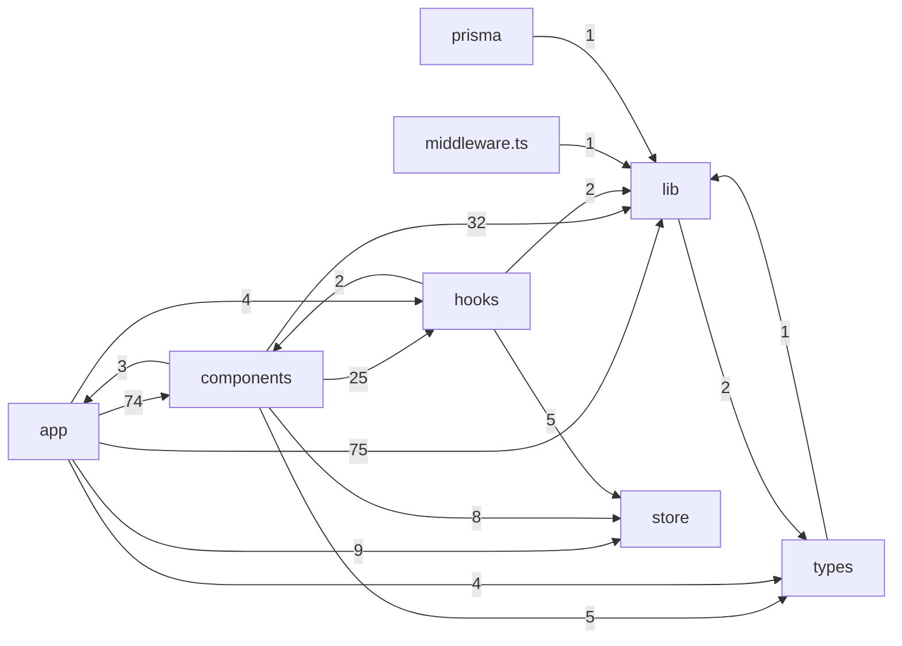
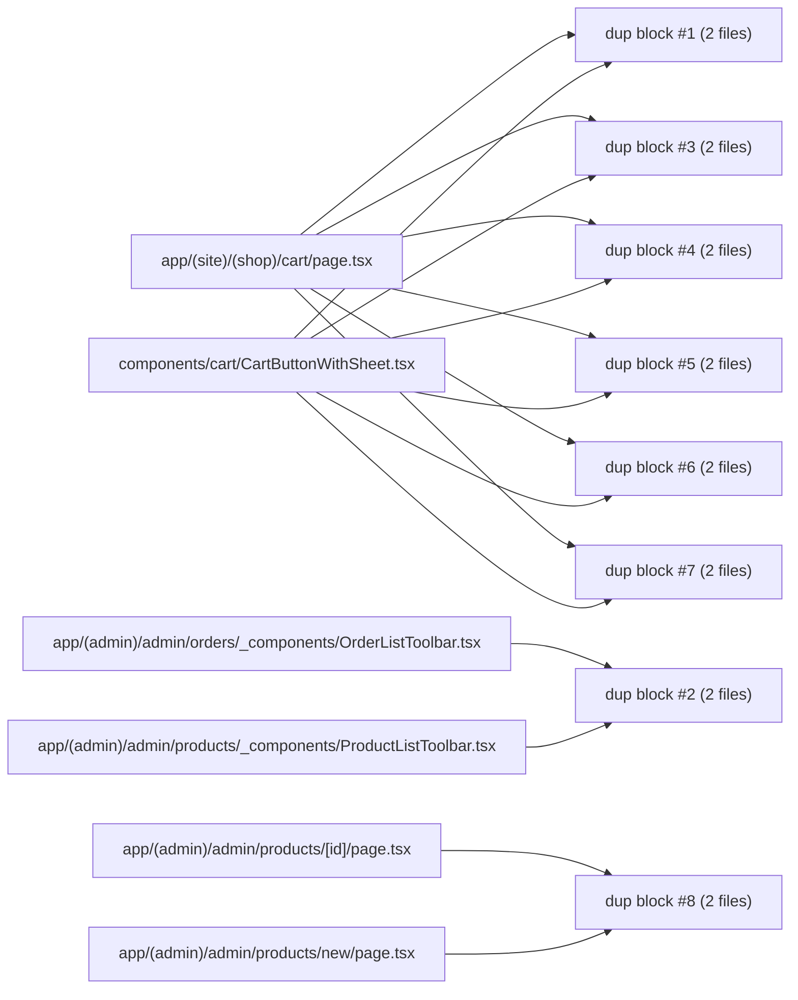

# Project dependency & usage maps (acme-commerce-starter)

- Files analyzed (TS/TSX/JS/JSX): **167**

- Internal import edges resolved: **343**

## High-level module flow (by folders)



## Most-used helpers/hooks (top 12) – and where they are used

```mermaid
flowchart LR
  lib_cn["lib:cn (31)"]
  f__admin___components_AdminSidebar_tsx["app/(admin)/_components/AdminSidebar.tsx"]
  f__admin___components_AdminSidebar_tsx --> lib_cn
  f__id__history_page_tsx["app/(admin)/admin/orders/[id]/history/page.tsx"]
  f__id__history_page_tsx --> lib_cn
  f_orders__id__page_tsx["app/(admin)/admin/orders/[id]/page.tsx"]
  f_orders__id__page_tsx --> lib_cn
  f_orders__components_OrderListToolbar_tsx["app/(admin)/admin/orders/_components/OrderListToolbar.tsx"]
  f_orders__components_OrderListToolbar_tsx --> lib_cn
  f_apps_web_app__admin__admin_orders_page_tsx["app/(admin)/admin/orders/page.tsx"]
  f_apps_web_app__admin__admin_orders_page_tsx --> lib_cn
  f_products__components_ProductListToolbar_tsx["app/(admin)/admin/products/_components/ProductListToolbar.tsx"]
  f_products__components_ProductListToolbar_tsx --> lib_cn
  f__components_form_GeneralSection_tsx["app/(admin)/admin/products/_components/form/GeneralSection.tsx"]
  f__components_form_GeneralSection_tsx --> lib_cn
  f_apps_web_app__admin__admin_products_page_tsx["app/(admin)/admin/products/page.tsx"]
  f_apps_web_app__admin__admin_products_page_tsx --> lib_cn
  f_apps_web_app__site___shop__cart_page_tsx["app/(site)/(shop)/cart/page.tsx"]
  f_apps_web_app__site___shop__cart_page_tsx --> lib_cn
  f_apps_web_components_cart_AddToCartIcon_tsx["components/cart/AddToCartIcon.tsx"]
  f_apps_web_components_cart_AddToCartIcon_tsx --> lib_cn
  f_components_cart_CartButtonWithSheet_tsx["components/cart/CartButtonWithSheet.tsx"]
  f_components_cart_CartButtonWithSheet_tsx --> lib_cn
  f_apps_web_components_cart_CartUndoChip_tsx["components/cart/CartUndoChip.tsx"]
  f_apps_web_components_cart_CartUndoChip_tsx --> lib_cn
  lib_prisma["lib:prisma (25)"]
  f_categories__id__page_tsx["app/(admin)/admin/categories/[id]/page.tsx"]
  f_categories__id__page_tsx --> lib_prisma
  f_admin_categories_actions_ts["app/(admin)/admin/categories/actions.ts"]
  f_admin_categories_actions_ts --> lib_prisma
  f_admin_categories_page_tsx["app/(admin)/admin/categories/page.tsx"]
  f_admin_categories_page_tsx --> lib_prisma
  f__id__history_page_tsx --> lib_prisma
  f_orders__id__page_tsx --> lib_prisma
  f__id__return_page_tsx["app/(admin)/admin/orders/[id]/return/page.tsx"]
  f__id__return_page_tsx --> lib_prisma
  f_apps_web_app__admin__admin_orders_actions_ts["app/(admin)/admin/orders/actions.ts"]
  f_apps_web_app__admin__admin_orders_actions_ts --> lib_prisma
  f_apps_web_app__admin__admin_orders_page_tsx --> lib_prisma
  f_apps_web_app__admin__admin_page_tsx["app/(admin)/admin/page.tsx"]
  f_apps_web_app__admin__admin_page_tsx --> lib_prisma
  f_products__id__page_tsx["app/(admin)/admin/products/[id]/page.tsx"]
  f_products__id__page_tsx --> lib_prisma
  f_admin_products_actions_ts["app/(admin)/admin/products/actions.ts"]
  f_admin_products_actions_ts --> lib_prisma
  f_products_new_page_tsx["app/(admin)/admin/products/new/page.tsx"]
  f_products_new_page_tsx --> lib_prisma
  lib_auth["lib:auth (13)"]
  f_admin_categories_actions_ts --> lib_auth
  f_apps_web_app__admin__admin_orders_actions_ts --> lib_auth
  f_admin_products_actions_ts --> lib_auth
  f_apps_web_app__admin__layout_tsx["app/(admin)/layout.tsx"]
  f_apps_web_app__admin__layout_tsx --> lib_auth
  f_orders__id__page_tsx["app/(site)/(account)/account/orders/[id]/page.tsx"]
  f_orders__id__page_tsx --> lib_auth
  f_account_orders_actions_ts["app/(site)/(account)/account/orders/actions.ts"]
  f_account_orders_actions_ts --> lib_auth
  f_account_orders_page_tsx["app/(site)/(account)/account/orders/page.tsx"]
  f_account_orders_page_tsx --> lib_auth
  f__account__account_page_tsx["app/(site)/(account)/account/page.tsx"]
  f__account__account_page_tsx --> lib_auth
  f_apps_web_app__site___account__layout_tsx["app/(site)/(account)/layout.tsx"]
  f_apps_web_app__site___account__layout_tsx --> lib_auth
  f__shop__checkout_actions_ts["app/(site)/(shop)/checkout/actions.ts"]
  f__shop__checkout_actions_ts --> lib_auth
  f_apps_web_app__site___shop__checkout_page_tsx["app/(site)/(shop)/checkout/page.tsx"]
  f_apps_web_app__site___shop__checkout_page_tsx --> lib_auth
  f_apps_web_app__site__auth_login_page_tsx["app/(site)/auth/login/page.tsx"]
  f_apps_web_app__site__auth_login_page_tsx --> lib_auth
  lib_formatMinor["lib:formatMinor (12)"]
  f_orders__id__page_tsx --> lib_formatMinor
  f_apps_web_app__admin__admin_orders_page_tsx --> lib_formatMinor
  f_apps_web_app__admin__admin_page_tsx --> lib_formatMinor
  f_apps_web_app__admin__admin_products_page_tsx --> lib_formatMinor
  f_account_orders_page_tsx --> lib_formatMinor
  f_apps_web_app__site___shop__cart_page_tsx --> lib_formatMinor
  f_apps_web_app__site___shop__checkout_page_tsx --> lib_formatMinor
  f_checkout_success_page_tsx["app/(site)/(shop)/checkout/success/page.tsx"]
  f_checkout_success_page_tsx --> lib_formatMinor
  f_components_cart_CartButtonWithSheet_tsx --> lib_formatMinor
  f_apps_web_components_catalog_ProductCard_tsx["components/catalog/ProductCard.tsx"]
  f_apps_web_components_catalog_ProductCard_tsx --> lib_formatMinor
  f_apps_web_lib_format_ts["lib/format.ts"]
  f_apps_web_lib_format_ts --> lib_formatMinor
  lib_parseCurrency["lib:parseCurrency (9)"]
  f_orders__id__page_tsx --> lib_parseCurrency
  f_apps_web_app__admin__admin_orders_page_tsx --> lib_parseCurrency
  f_apps_web_app__admin__admin_products_page_tsx --> lib_parseCurrency
  f_account_orders_page_tsx --> lib_parseCurrency
  f_product__slug__page_tsx["app/(site)/(public)/product/[slug]/page.tsx"]
  f_product__slug__page_tsx --> lib_parseCurrency
  f_checkout_success_page_tsx --> lib_parseCurrency
  f_apps_web_lib_format_ts --> lib_parseCurrency
  f_apps_web_lib_server_orders_ts["lib/server/orders.ts"]
  f_apps_web_lib_server_orders_ts --> lib_parseCurrency
  hooks_CheckoutFormState["hooks:CheckoutFormState (7)"]
  f_checkout_shipping_CheckoutContactFields_tsx["components/checkout/shipping/CheckoutContactFields.tsx"]
  f_checkout_shipping_CheckoutContactFields_tsx --> hooks_CheckoutFormState
  f_checkout_shipping_CheckoutShippingHome_tsx["components/checkout/shipping/CheckoutShippingHome.tsx"]
  f_checkout_shipping_CheckoutShippingHome_tsx --> hooks_CheckoutFormState
  f_checkout_shipping_CheckoutShippingPickup_tsx["components/checkout/shipping/CheckoutShippingPickup.tsx"]
  f_checkout_shipping_CheckoutShippingPickup_tsx --> hooks_CheckoutFormState
  f_checkout_shipping_CheckoutShippingStore_tsx["components/checkout/shipping/CheckoutShippingStore.tsx"]
  f_checkout_shipping_CheckoutShippingStore_tsx --> hooks_CheckoutFormState
  f_checkout_steps_CheckoutPaymentStep_tsx["components/checkout/steps/CheckoutPaymentStep.tsx"]
  f_checkout_steps_CheckoutPaymentStep_tsx --> hooks_CheckoutFormState
  f_checkout_steps_CheckoutReviewStep_tsx["components/checkout/steps/CheckoutReviewStep.tsx"]
  f_checkout_steps_CheckoutReviewStep_tsx --> hooks_CheckoutFormState
  f_checkout_steps_CheckoutShippingStep_tsx["components/checkout/steps/CheckoutShippingStep.tsx"]
  f_checkout_steps_CheckoutShippingStep_tsx --> hooks_CheckoutFormState
  hooks_useAppDispatch["hooks:useAppDispatch (6)"]
  f_apps_web_app__site___shop__cart_page_tsx --> hooks_useAppDispatch
  f_apps_web_components_cart_AddToCartButton_tsx["components/cart/AddToCartButton.tsx"]
  f_apps_web_components_cart_AddToCartButton_tsx --> hooks_useAppDispatch
  f_apps_web_components_cart_AddToCartIcon_tsx --> hooks_useAppDispatch
  f_components_cart_CartButtonWithSheet_tsx --> hooks_useAppDispatch
  f_checkout_core_ClearCartOnMount_tsx["components/checkout/core/ClearCartOnMount.tsx"]
  f_checkout_core_ClearCartOnMount_tsx --> hooks_useAppDispatch
  f_apps_web_hooks_use_cart_undo_rows_ts["hooks/use-cart-undo-rows.ts"]
  f_apps_web_hooks_use_cart_undo_rows_ts --> hooks_useAppDispatch
  hooks_useAppSelector["hooks:useAppSelector (5)"]
  f_components_cart_CartButtonWithSheet_tsx --> hooks_useAppSelector
  f_components_catalog_ProductActions_tsx["components/catalog/ProductActions.tsx"]
  f_components_catalog_ProductActions_tsx --> hooks_useAppSelector
  f_apps_web_components_catalog_ProductCard_tsx --> hooks_useAppSelector
  f_apps_web_hooks_use_cart_undo_rows_ts --> hooks_useAppSelector
  f_apps_web_hooks_use_cart_view_ts["hooks/use-cart-view.ts"]
  f_apps_web_hooks_use_cart_view_ts --> hooks_useAppSelector
  hooks_CheckoutClientErrors["hooks:CheckoutClientErrors (5)"]
  f_checkout_shipping_CheckoutContactFields_tsx --> hooks_CheckoutClientErrors
  f_checkout_shipping_CheckoutShippingHome_tsx --> hooks_CheckoutClientErrors
  f_checkout_shipping_CheckoutShippingPickup_tsx --> hooks_CheckoutClientErrors
  f_checkout_shipping_CheckoutShippingStore_tsx --> hooks_CheckoutClientErrors
  f_checkout_steps_CheckoutShippingStep_tsx --> hooks_CheckoutClientErrors
  lib_DEFAULT_CURRENCY["lib:DEFAULT_CURRENCY (4)"]
  f_apps_web_app__admin__admin_page_tsx --> lib_DEFAULT_CURRENCY
  f_apps_web_app__site___shop__cart_page_tsx --> lib_DEFAULT_CURRENCY
  f_components_cart_CartButtonWithSheet_tsx --> lib_DEFAULT_CURRENCY
  f_apps_web_components_catalog_ProductCard_tsx --> lib_DEFAULT_CURRENCY
  lib_PER_PAGE["lib:PER_PAGE (3)"]
  f_cat__slug__page_tsx["app/(site)/(public)/cat/[slug]/page.tsx"]
  f_cat__slug__page_tsx --> lib_PER_PAGE
  f__public__catalogo_page_tsx["app/(site)/(public)/catalogo/page.tsx"]
  f__public__catalogo_page_tsx --> lib_PER_PAGE
  f_apps_web_app__site___public__page_tsx["app/(site)/(public)/page.tsx"]
  f_apps_web_app__site___public__page_tsx --> lib_PER_PAGE
  hooks_ShippingType["hooks:ShippingType (3)"]
  f_checkout_success_page_tsx --> hooks_ShippingType
  f_checkout_shared_checkout_summary_ts["components/checkout/shared/checkout-summary.ts"]
  f_checkout_shared_checkout_summary_ts --> hooks_ShippingType
  f_checkout_steps_CheckoutShippingStep_tsx --> hooks_ShippingType
```



## Top duplicated code blocks (heuristic)



### Duplicate block details (first 8)

**dup block #1** – appears in 2 files:

- `apps/web/app/(site)/(shop)/cart/page.tsx` (normalized lines 152-163)

- `apps/web/components/cart/CartButtonWithSheet.tsx` (normalized lines 228-239)

Snippet:

```text
>
{r.qty}
</span>
<button
className={cn(
"text-base hover:cursor-pointer px-3 py-1 hover:bg-neutral-100",
isMaxed && "pointer-events-none text-slate-300",
)}
aria-label="Sumar unidad"
disabled={isMaxed}
onClick={() =>
dispatch(
```

**dup block #2** – appears in 2 files:

- `apps/web/app/(admin)/admin/orders/_components/OrderListToolbar.tsx` (normalized lines 125-136)

- `apps/web/app/(admin)/admin/products/_components/ProductListToolbar.tsx` (normalized lines 226-237)

Snippet:

```text
<SelectTrigger className="h-8 w-[180px] text-xs font-medium">
<div className="flex items-center gap-2">
<FaSort className="h-3.5 w-3.5 text-muted-foreground" />
<SelectValue placeholder="Ordenar por" />
</div>
</SelectTrigger>
<SelectContent align="end">
{SORT_OPTIONS.map((option) => (
<SelectItem
key={option.value}
value={option.value}
className="text-xs"
```

**dup block #3** – appears in 2 files:

- `apps/web/app/(site)/(shop)/cart/page.tsx` (normalized lines 194-205)

- `apps/web/components/cart/CartButtonWithSheet.tsx` (normalized lines 271-282)

Snippet:

```text
}
/>
</div>
</div>
);
}
const entry = item.entry;
return (
<CartUndoChip
key={`undo-${entry.slug}-${entry.removedAt}`}
entry={entry}
onUndo={handleUndo}
```

**dup block #4** – appears in 2 files:

- `apps/web/app/(site)/(shop)/cart/page.tsx` (normalized lines 160-171)

- `apps/web/components/cart/CartButtonWithSheet.tsx` (normalized lines 236-247)

Snippet:

```text
aria-label="Sumar unidad"
disabled={isMaxed}
onClick={() =>
dispatch(
setQty({
slug: r.slug,
variantId: r.variantId,
qty: r.qty + 1,
}),
)
}
>
```

**dup block #5** – appears in 2 files:

- `apps/web/app/(site)/(shop)/cart/page.tsx` (normalized lines 156-167)

- `apps/web/components/cart/CartButtonWithSheet.tsx` (normalized lines 232-243)

Snippet:

```text
className={cn(
"text-base hover:cursor-pointer px-3 py-1 hover:bg-neutral-100",
isMaxed && "pointer-events-none text-slate-300",
)}
aria-label="Sumar unidad"
disabled={isMaxed}
onClick={() =>
dispatch(
setQty({
slug: r.slug,
variantId: r.variantId,
qty: r.qty + 1,
```

**dup block #6** – appears in 2 files:

- `apps/web/app/(site)/(shop)/cart/page.tsx` (normalized lines 142-153)

- `apps/web/components/cart/CartButtonWithSheet.tsx` (normalized lines 218-229)

Snippet:

```text
qty: Math.max(0, r.qty - 1),
}),
)
}
>
−
</button>
<span
className="px-2 py-1 text-center text-sm font-medium"
aria-live="polite"
>
{r.qty}
```

**dup block #7** – appears in 2 files:

- `apps/web/app/(site)/(shop)/cart/page.tsx` (normalized lines 155-166)

- `apps/web/components/cart/CartButtonWithSheet.tsx` (normalized lines 231-242)

Snippet:

```text
<button
className={cn(
"text-base hover:cursor-pointer px-3 py-1 hover:bg-neutral-100",
isMaxed && "pointer-events-none text-slate-300",
)}
aria-label="Sumar unidad"
disabled={isMaxed}
onClick={() =>
dispatch(
setQty({
slug: r.slug,
variantId: r.variantId,
```

**dup block #8** – appears in 2 files:

- `apps/web/app/(admin)/admin/products/[id]/page.tsx` (normalized lines 18-29)

- `apps/web/app/(admin)/admin/products/new/page.tsx` (normalized lines 4-15)

Snippet:

```text
const categories = await prisma.category.findMany({
select: { id: true, name: true },
orderBy: { name: "asc" },
});
const variantsData = await prisma.productVariant.findMany({
select: { size: true, color: true },
distinct: ["size", "color"],
});
const existingSizes = Array.from(new Set(variantsData.map((v) => v.size)));
const existingColors = Array.from(new Set(variantsData.map((v) => v.color)));
return (
<div className="space-y-6">
```
