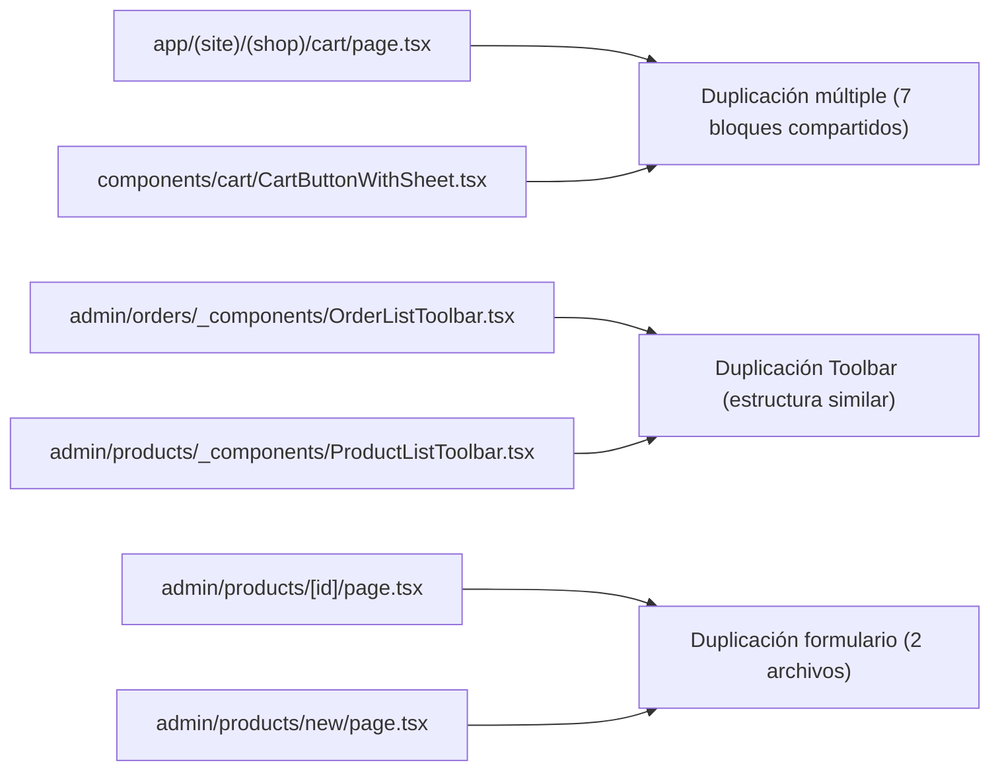

```mermaid
flowchart LR

  %% === ARCHIVOS ===
  CartPage["app/(site)/(shop)/cart/page.tsx"]
  CartSheet["components/cart/CartButtonWithSheet.tsx"]

  OrdersToolbar["admin/orders/_components/OrderListToolbar.tsx"]
  ProductsToolbar["admin/products/_components/ProductListToolbar.tsx"]

  ProductEdit["admin/products/[id]/page.tsx"]
  ProductNew["admin/products/new/page.tsx"]

  %% === BLOQUES DUPLICADOS ===
  DupCart["Duplicación múltiple (7 bloques compartidos)"]
  DupToolbar["Duplicación Toolbar (estructura similar)"]
  DupProductForm["Duplicación formulario (2 archivos)"]

  %% === RELACIONES ===
  CartPage --> DupCart
  CartSheet --> DupCart

  OrdersToolbar --> DupToolbar
  ProductsToolbar --> DupToolbar

  ProductEdit --> DupProductForm
  ProductNew --> DupProductForm
```
