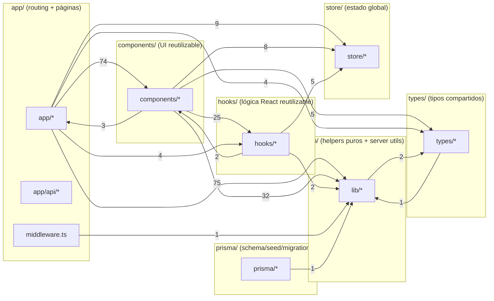

```mermaid
flowchart LR

  %% =========================
  %% CAPAS
  %% =========================
  subgraph APP["app/ (routing + páginas)"]
    A1["app/*"]
    Aapi["app/api/*"]
    Amid["middleware.ts"]
  end

  subgraph UI["components/ (UI reutilizable)"]
    C1["components/*"]
  end

  subgraph HOOKS["hooks/ (lógica React reutilizable)"]
    H1["hooks/*"]
  end

  subgraph LIB["lib/ (helpers puros + server utils)"]
    L1["lib/*"]
  end

  subgraph STORE["store/ (estado global)"]
    S1["store/*"]
  end

  subgraph TYPES["types/ (tipos compartidos)"]
    T1["types/*"]
  end

  subgraph PRISMA["prisma/ (schema/seed/migrations)"]
    P1["prisma/*"]
  end

  %% =========================
  %% FLUJOS (con “peso”)
  %% =========================
  A1 -->|75| L1
  A1 -->|74| C1
  C1 -->|32| L1
  C1 -->|25| H1

  A1 -->|9| S1
  C1 -->|8| S1
  H1 -->|5| S1

  C1 -->|5| T1
  A1 -->|4| T1
  A1 -->|4| H1

  %% Casos menos comunes / posibles olores
  C1 -->|3| A1
  H1 -->|2| L1
  H1 -->|2| C1
  L1 -->|2| T1
  T1 -->|1| L1

  Amid -->|1| L1
  P1 -->|1| L1
```
