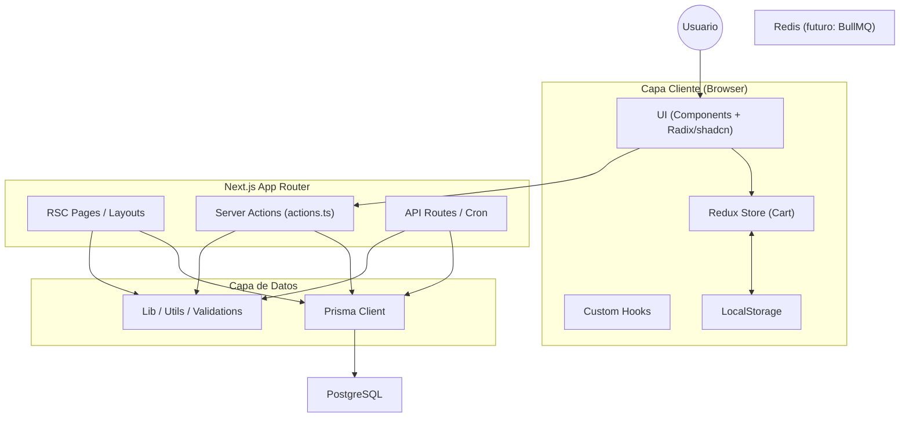
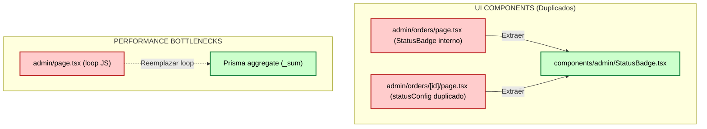
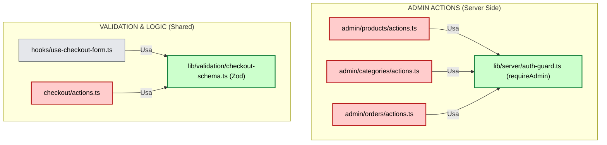

# Arquitectura general (runtime)

```mermaid
flowchart TD
  User((Usuario))

  subgraph Client["Capa Cliente (Browser)"]
    UI["UI (Components + Radix/shadcn)"]
    Redux["Redux Store (Cart)"]
    Hooks["Custom Hooks"]
    LS["LocalStorage"]
  end

  subgraph Next["Next.js App Router"]
    Pages["RSC Pages / Layouts"]
    Actions["Server Actions (actions.ts)"]
    API["API Routes / Cron"]
  end

  subgraph Data["Capa de Datos"]
    Prisma["Prisma Client"]
    Utils["Lib / Utils / Validations"]
  end

  DB["PostgreSQL"]
  Redis["Redis (futuro: BullMQ)"]

  User --> UI
  UI --> Redux
  Redux <--> LS

  UI --> Actions
  Pages --> Prisma
  Actions --> Prisma
  API --> Prisma
  Prisma --> DB

  Actions --> Utils
  Pages --> Utils
  API --> Utils
```

```mermaid
graph TD
    %% --- LEYENDA ---
    classDef problem fill:#ffcccc,stroke:#b91c1c,stroke-width:2px,color:#000;
    classDef solution fill:#ccffcc,stroke:#15803d,stroke-width:2px,color:#000;
    classDef existing fill:#e5e7eb,stroke:#374151,color:#000;

    subgraph "UI COMPONENTS (Duplicados)"
        Page_Orders["admin/orders/page.tsx (StatusBadge interno)"]:::problem
        Page_OrderDet["admin/orders/[id]/page.tsx (statusConfig duplicado)"]:::problem
        SharedBadge["components/admin/StatusBadge.tsx"]:::solution
    end

    subgraph "PERFORMANCE BOTTLENECKS"
        Dashboard["admin/page.tsx (loop JS)"]:::problem
        PrismaAgg["Prisma aggregate (_sum)"]:::solution
    end

    %% --- RELACIONES ---
    Page_Orders -->|Extraer| SharedBadge
    Page_OrderDet -->|Extraer| SharedBadge

    Dashboard -.->|Reemplazar loop| PrismaAgg
```

```mermaid
graph TD
    %% --- LEYENDA ---
    classDef problem fill:#ffcccc,stroke:#b91c1c,stroke-width:2px,color:#000;
    classDef solution fill:#ccffcc,stroke:#15803d,stroke-width:2px,color:#000;
    classDef existing fill:#e5e7eb,stroke:#374151,color:#000;

    subgraph "ADMIN ACTIONS (Server Side)"
        Action_Prod["admin/products/actions.ts"]:::problem
        Action_Cat["admin/categories/actions.ts"]:::problem
        Action_Ord["admin/orders/actions.ts"]:::problem

        AuthGuard["lib/server/auth-guard.ts (requireAdmin)"]:::solution
    end

    subgraph "VALIDATION & LOGIC (Shared)"
        CheckoutHook["hooks/use-checkout-form.ts"]:::existing
        CheckoutAction["checkout/actions.ts"]:::problem
        ZodSchema["lib/validation/checkout-schema.ts (Zod)"]:::solution
    end


    %% --- RELACIONES ---
    Action_Prod -->|Usa| AuthGuard
    Action_Cat -->|Usa| AuthGuard
    Action_Ord -->|Usa| AuthGuard

    CheckoutHook -->|Usa| ZodSchema
    CheckoutAction -->|Usa| ZodSchema
```
