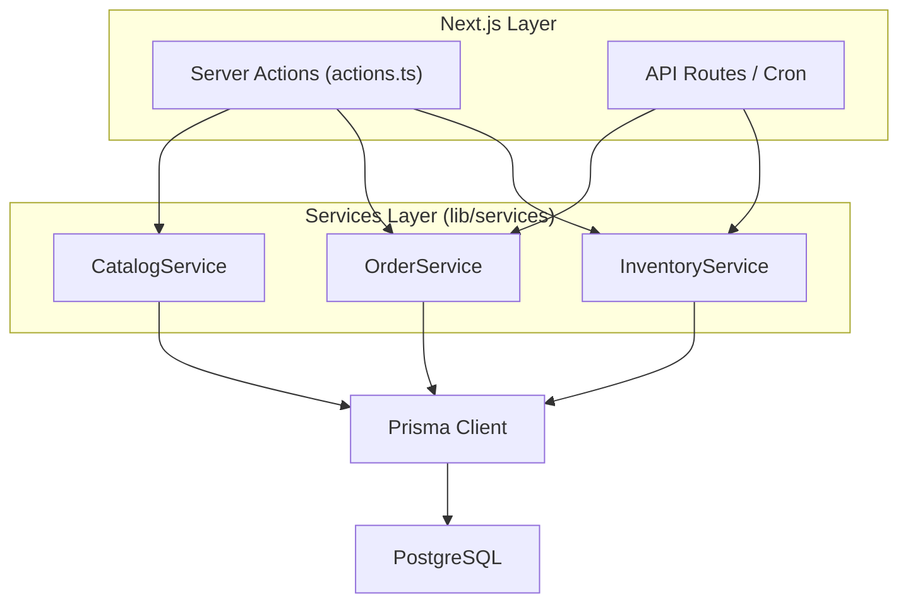
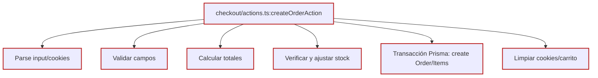
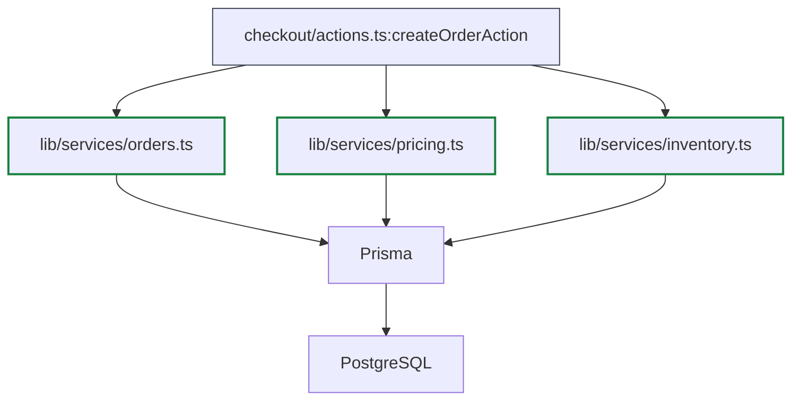

---

## 3) `ARCHITECTURE.actions.god-functions.as-is-vs-to-be.md`

```md
# Server Actions “God Functions” — AS-IS vs TO-BE

## AS-IS (actual)

Problema: algunas actions hacen demasiadas cosas (parseo, validación, cálculos, stock, transacción, side-effects).
Ejemplo típico: `createOrderAction` en checkout.
```

Objetivo: sacar lógica pesada de `actions.ts` y centralizar reglas en servicios.
Beneficio: menos “God functions”, menos duplicación, más testeable.






