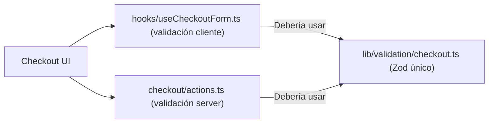
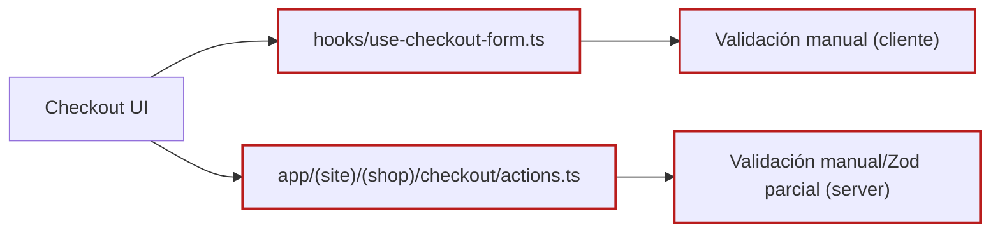
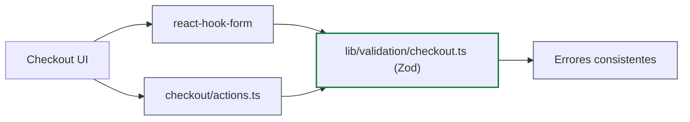

## 2) `ARCHITECTURE.checkout.validation.as-is-vs-to-be.md`

```md
# Checkout — Validación AS-IS vs TO-BE

## AS-IS (actual)

Problema: validación duplicada e inconsistente:

- Cliente: validación manual en `useCheckoutForm`
- Servidor: validación distinta en `checkout/actions.ts`
```






