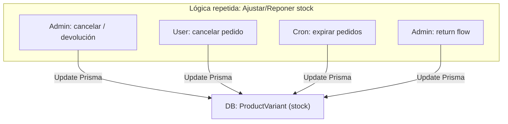
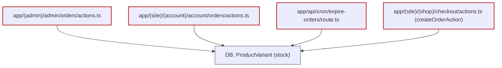
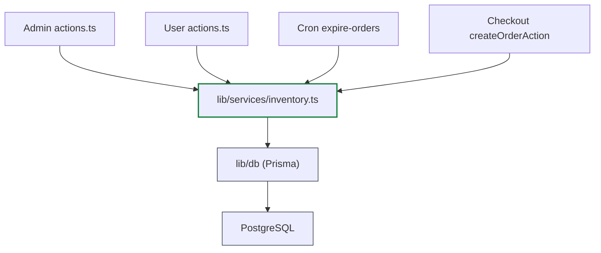

# Inventario / Stock — AS-IS vs TO-BE

## AS-IS (actual)

Problema: la lógica de reponer/ajustar stock está duplicada en varios puntos.
Riesgo: cambias una regla y te olvidas de otro sitio.

```mermaid
flowchart TD
  subgraph ReStock["Lógica repetida: Ajustar/Reponer stock"]
    AdminCancel["Admin: cancelar / devolución"]
    UserCancel["User: cancelar pedido"]
    CronExpire["Cron: expirar pedidos"]
    AdminReturn["Admin: return flow"]
  end

  DB["DB: ProductVariant (stock)"]

  AdminCancel -->|Update Prisma| DB
  UserCancel -->|Update Prisma| DB
  CronExpire -->|Update Prisma| DB
  AdminReturn -->|Update Prisma| DB
```

```mermaid
flowchart TD
  AdminOrdersActions["app/(admin)/admin/orders/actions.ts"] --> DB["DB: ProductVariant (stock)"]
  UserOrdersActions["app/(site)/(account)/account/orders/actions.ts"] --> DB
  CronExpire["app/api/cron/expire-orders/route.ts"] --> DB
  CheckoutCreateOrder["app/(site)/(shop)/checkout/actions.ts (createOrderAction)"] --> DB

  style AdminOrdersActions fill:,stroke:#b91c1c,stroke-width:2px
  style UserOrdersActions fill:,stroke:#b91c1c,stroke-width:2px
  style CronExpire fill:,stroke:#b91c1c,stroke-width:2px
  style CheckoutCreateOrder fill:,stroke:#b91c1c,stroke-width:2px
  style DB fill,stroke:#374151
```

```mermaid
flowchart TD
  AdminOrdersActions["Admin actions.ts"] --> Inventory["lib/services/inventory.ts"]
  UserOrdersActions["User actions.ts"] --> Inventory
  CronExpire["Cron expire-orders"] --> Inventory
  CheckoutCreateOrder["Checkout createOrderAction"] --> Inventory

  Inventory --> Prisma["lib/db (Prisma)"]
  Prisma --> DB["PostgreSQL"]

  style Inventory fill:,stroke:#15803d,stroke-width:2px
  style Prisma fill:,stroke:#374151
  style DB fill:,stroke:#374151
```
